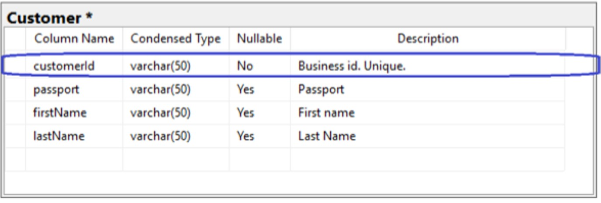
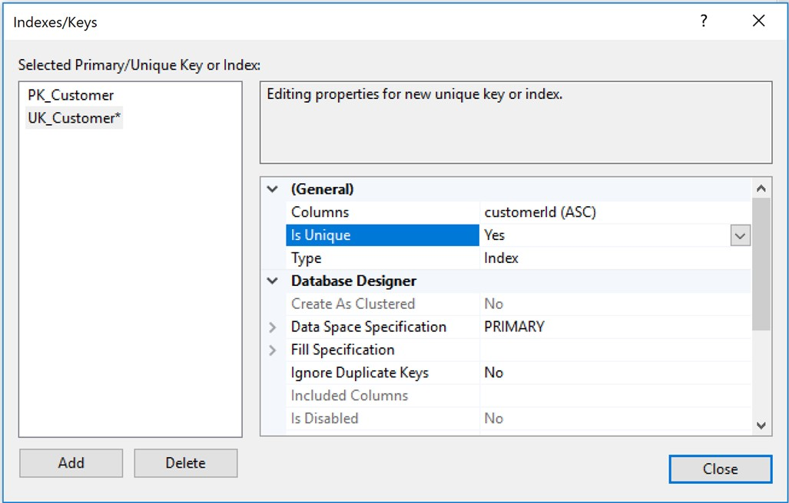
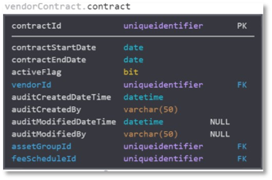

# db-schema-design-guidelines
Database SQL schema design and data modelling guidelines

## Intro
### Summary
This document lists different patterns for logical and physical data modelling. It can read as a cookbook for good data modelling and SQL schema design.  
Of course, this list is always being updated, and the list never will be completed or finished. It may not answer your problem today. But I have been collecting scenarios to say that it is the most comprehensive list of guidance. So, I present this list as the best advice for several situations and scenarios; with all humility, this will be useful for most professionals and organisations trying to standardise data design. This is presented as a list of guidelines and best practices to consider when producing logical, physical data models and avoiding re-work or technical debt. The subjects have a heavy enterprise and solution architecture and design viewpoint, this is because it is most likely to be used by those trying to instrument governance over development groups.
### Architecture Governance
Architects can benefit from database SQL schema and data modelling guidance from several viewpoints.  
 
**Standardization of data modelling**   
Guidelines and standard SQL schema designs ensure consistency and standardization across projects, fostering a unified data architecture and facilitating collaboration.  
 
**Improved Data Quality**  
 Following guidelines leads to data normalization, validation, and integrity, improving data quality, reducing inconsistencies, and enhancing data reliability.  
  
**Scalability**   
Best practices in data modelling cater to scalability, allowing data structures to accommodate growth and business changes without major restructuring or performance issues.  
 
**Efficient Data Retrieval**  
Logical and physical data modelling patterns optimize data storage and retrieval, leveraging techniques like indexing and columnar storage to boost system performance.   
 
**Easier Maintenance**  
Well-designed data models ease database schema maintenance, minimizing schema changes and avoiding technical debt.   
 
**Enhanced Security**  
Data modelling guidelines incorporate security measures, protecting sensitive data, compliance with privacy regulations, and safeguarding organizational data.   
 
**Alignment with Business Goals**  
Architects align the data model with business goals and requirements, which is crucial for delivering valuable insights and supporting decision-making processes.  
## Capabilities
I've listed the capabilities in no particular order. Most of these capabilities provide some references to tools and libraries. Most of them are open-sourced. These may flourish or die without notice. 
## Use
After reading any of the capabilities, I recommend doing your own research. If you have comments or disagree, or find gaps, pls reach out, collaborators are welcome to the project. 
Each of the capabilities may apply to one or more Categories. So they are tagged by "Category".
 
 
 
# SQL Styling
## Category
## Comments
It is strongly recommended to read, understand and incorporate SQL Styling standards.  
## Description
GitLab SQL Styling best practices  
https://about.gitlab.com/handbook/business-technology/data-team/platform/sql-style-guide/   
SQL Style Guide- (by Simon Holywell)  
https://www.sqlstyle.guide/  
Mozilla Data Documentation - SQL Style Guide  
https://docs.telemetry.mozilla.org/concepts/sql_style.html 
 
 
 
# SQL Linter 
To be included in the CI-CD pipeline
## Category
## Comments
It helps you write good SQL and catch errors and bad SQL before it hits your database.  
In addition, if the project contains “.sql” files, it is recommended to incorporate a SQL Linter into the CI-CD pipeline.   
For example:
## Description
**SQL Fluff	Source code quality	SQL linter**  
Source code linter specialising in SQL statements.	SQL Linter  
https://docs.sqlfluff.com/en/stable/   
**SQL Lint	Source code quality	SQL Linter** 
Source code linter specialising in SQL statements.	SQL Linter   
https://github.com/joereynolds/sql-lint
 
 
 
# Primary Key design
## Category
## Comments
There are several theories about the design of primary keys. The discussion about the primary key can be of various kinds.  
Firstly, avoid multi-column primary keys. These can introduce complexity and make it difficult to query.   
Secondly, the design of the primary key high-performance systems is different from enterprise platforms.   
So, in most cases, for enterprise applications, we advise using a surrogate primary key of the type GUID. Although these are not human-friendly, in most scenarios are better than other options, such as Natural Keys, Business keys, and also auto-generated sequential integers.   
Also, avoid other bad options such as simple Date-time or composed keys, for example:  
``FirstName-LastName-City-TimeStamp``, or ``Product-ProductPart-ProductCode``, etc.  
If it is required to have displayable user-friendly ids for the end-user, it is better to adopt other design strategies. See the Custom Human Readable id and Mnemotechnical hash id sections of this document.   
This category of IDs must also be considered if the system will be implementing APIs. The Restful API URLs are assumed to be used by humans.  
## References:
https://vertabelo.com/blog/primary-key/ 
 
 
 
# Unique Id – GUID or UUID or GUID
## Category
## Comments
**Introduction**  
It is the design for a well-constructed Primary Key. It is called UUID or GUID type.  
It is also known as “UniqueIdentifier”. This key also fits into the category of the surrogate artificial Key.
This is an Internet Engineering Task Force (IETF), an international standard managed by a specification that, at the time of writing this document, the latest version is rfc4122 v4.122.
The purpose of this key is to have an identification that brings some indirection to relationships among entities and makes refactoring, migrations, re-building, and re-indexing of microservices databases easier.   
This field has to be configured as "Unique" in the table definition.   
Using this key to all tables on microservices allows refactoring and migrating data without having to worry about the physical and business keys, which you do not control. 
Since our system is not based on a single relational database, we must have a strategy for these "soft foreign keys" across microservices.  
So microservices can generate this key and provide it to other microservices for reference.  
If we need to re-build the DB, the database engine may assign a different one if we were using the physical key auto-generated sequential. But with this unique key will be the same, and your relationships across multiple DBs, the integrity of the overall system will remain intact.  
Business keys could be better, too, for other reasons. Law changes and regulations can badly affect systems based on an external business key we do not have any control over.   
As this type of id is to identify a row in the database, this pattern also applies to foreign keys.  
 
**Format**  
The format of this key is of the format: ``NNNNN-NNNNN-NNNNN-NNNNN``   
Where ``‘N’`` is Alphanumeric:``[0-9] | [A-Z] | [a-z]``  
Example: ``A2eXh-HBwHj-Gd04t-zezmP-ojU65``  
For more information, see surrogate Key pattern references. 
  
**Schema Field definition** 
The convention for this field can be:  
``Varchar (50)`` - ``primary Key``.  
 

 
 
``Unique`` 
 

 
 
**Naming Convention**  
The name of the field should be:  
``<The same name used on the table>`` + ``'Id'``  
For example: ``Contract`` (table name) + ``Id`` =  ``ContractId``  
 

 
**Unique Identifier – Suffix**   
The rationale for this convention is for clarity when querying multiple tables.   
For example, if the unique identifiers of each table are only ``Id``, a select query will bring all columns names of both tables, but they would have indistinguishable names; both will be ``Id``.   
So, by adopting this convention, each of these columns will have its unique name.  
 
**Time-creation awareness**  
This was introduced in the MongoDB implementation. 
This implementation caters to the Id to be sortable by time-creation using: ``ObjectId.getTimestamp()``, which returns the timestamp portion of the object as a Date. 
This is optimal for database sharding. 
For more information, see MongoDB Object id implementation references. 
 
**Centralised service - IDs generation**  
This can be done by a dedicated API that creates an Id.  
For example, Twitter’s Snowflake implements a  Thrift service that uses Apache ZooKeeper to coordinate nodes and then generates 64-bit unique IDs. 
In the case of needing a centralised service to generate Ids, there may be a need to be highly performant and available. Or generate Ids in batches and use a buffer using a Cache platform.  
## References
**UUID V4 Random Generation standard**  
UUID V4 Random Generation. Version 4 generates a Unique ID based on random number generation. … Version 4 is also commonly referred to as a GUID. While a GUID doesn’t follow the same specification as UUIDs, it is the same basic format. 
https://datatracker.ietf.org/doc/html/rfc4122    
  
**Wikipedia GUID**  
https://en.wikipedia.org/wiki/Universally_unique_identifier  
  
**JS UUID library**  
A library to generate the unique IDs  
https://www.npmjs.com/package/uuid  
  
**Surrogate key**  
Surrogate Key pattern  
https://en.wikipedia.org/wiki/Surrogate_key  
  
**UUId - MongoDB implementation**  
This was introduced in the MongoDB implementation  
https://www.mongodb.com/docs/manual/reference/method/ObjectId/   
 
 
 
--End of File--
