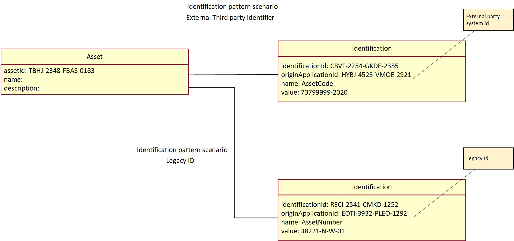
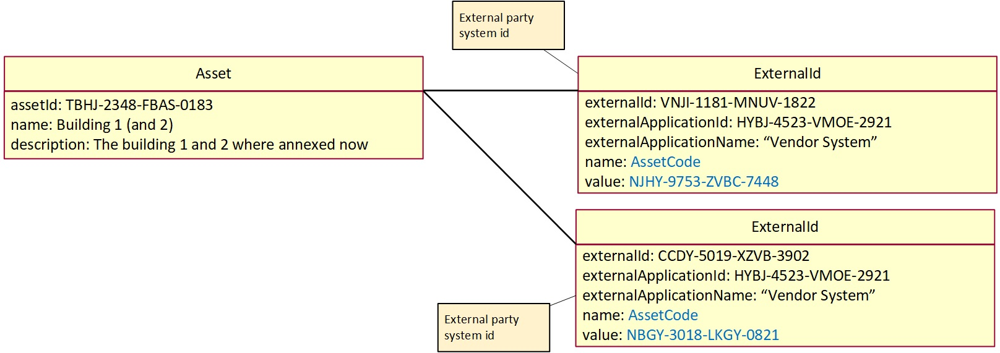
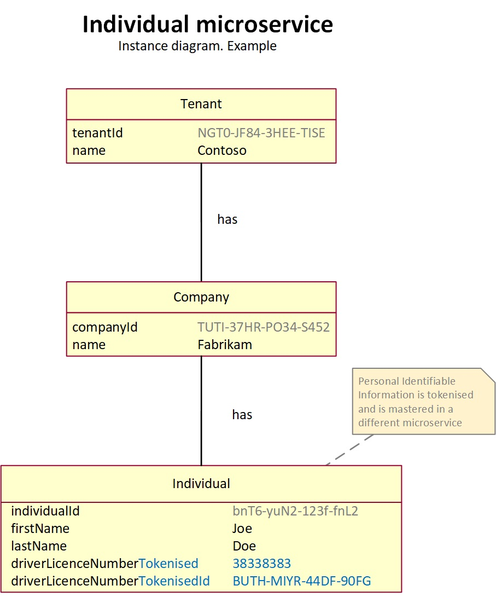
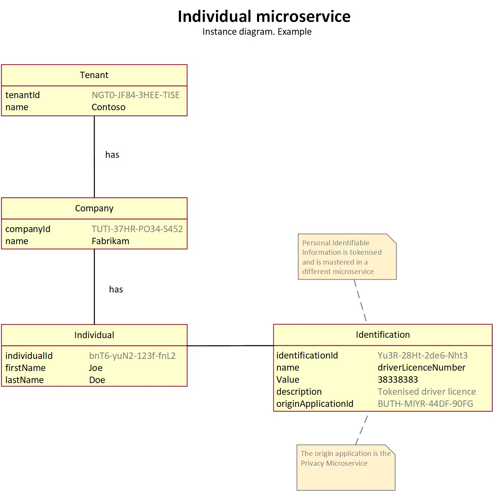
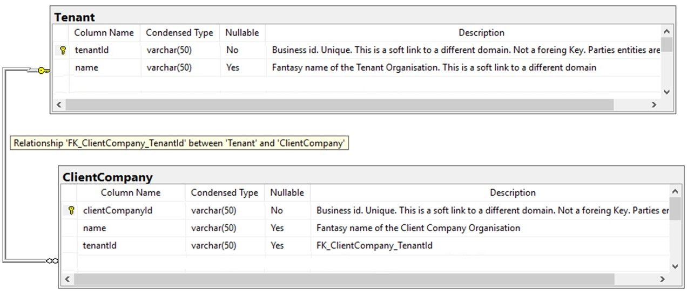
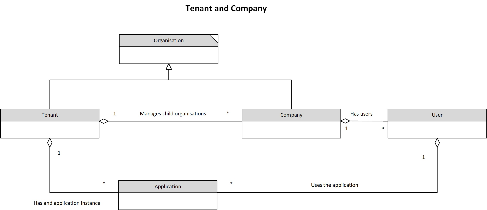
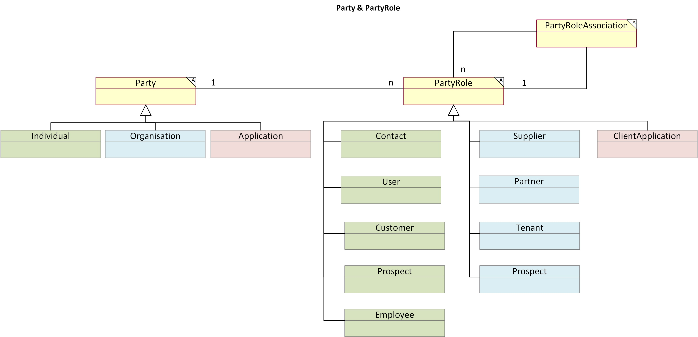

# db-schema-design-guidelines
Database SQL schema design and data modelling guidelines

## Intro
### Summary
This document lists different patterns for logical and physical data modelling. It can read as a cookbook for good data modelling and SQL schema design.  
Of course, this list is always being updated, and the list never will be completed or finished. It may not answer your problem today. But I have been collecting scenarios to say it is the most comprehensive list of guidance I know.  
So, I present this list as the best advice for several situations and scenarios; with all humility, this will be useful for most professionals and organisations trying to standardise data design. This is presented as a list of guidelines and best practices to consider when producing logical, physical data models and avoiding re-work or technical debt.   The subjects have a heavy enterprise and solution architecture and design viewpoint because it is most likely used by those trying to instrument governance over development groups.
### Architecture Governance
Architects can benefit from database SQL schema and data modelling guidance from several viewpoints.  
 
**Standardization of data modelling**   
Guidelines and standard SQL schema designs ensure consistency and standardization across projects, fostering a unified data architecture and facilitating collaboration.  
 
**Improved Data Quality**  
 Following guidelines leads to data normalization, validation, and integrity, improving data quality, reducing inconsistencies, and enhancing data reliability.  
  
**Scalability**   
Best practices in data modelling cater to scalability, allowing data structures to accommodate growth and business changes without major restructuring or performance issues.  
 
**Efficient Data Retrieval**  
Logical and physical data modelling patterns optimize data storage and retrieval, leveraging techniques like indexing and columnar storage to boost system performance.   
 
**Easier Maintenance**  
Well-designed data models ease database schema maintenance, minimizing schema changes and avoiding technical debt.   
 
**Enhanced Security**  
Data modelling guidelines incorporate security measures, protecting sensitive data, compliance with privacy regulations, and safeguarding organizational data.   
 
**Alignment with Business Goals**  
Architects align the data model with business goals and requirements, which is crucial for delivering valuable insights and supporting decision-making processes.  
## Capabilities
I've listed the capabilities in no particular order.   It is important how to read them; the capabilities may overlap, or some of them are subspecialisation of others. Some of them are complimentary. So, I organise them into topics or subjects that, in most cases, can be read independently and also implemented independently, with obvious exception of course.
Lastly, it is important to note that most of these capabilities provide some references to websites, tools and libraries. Most of them are open-sourced. These may flourish or die without notice. 
## Use
After reading any of the capabilities, I recommend doing your own research. Please let me know if you have comments, disagree, or find gaps. Collaborators are welcome to the project. 
Each of the capabilities may apply to one or more Categories. So they are tagged by "Category".
## Disclaimer
There are lots of original material on this page. However, I have read and collected information from other places too. In most cases, I summarised and wrapped the information with my flavour. In these cases, I kept the links to the original sources as much as possible for reference if I missed some. My apologies. It is not my intention to take credit for other people's work.
 
 
 
# SQL Styling
## Category
## Description
It is strongly recommended to read, understand and incorporate SQL Styling standards.  
## References
GitLab SQL Styling best practices  
https://about.gitlab.com/handbook/business-technology/data-team/platform/sql-style-guide/   
SQL Style Guide- (by Simon Holywell)  
https://www.sqlstyle.guide/  
Mozilla Data Documentation - SQL Style Guide  
https://docs.telemetry.mozilla.org/concepts/sql_style.html 
 
 
 
# SQL Linter 
To be included in the CI-CD pipeline
## Category
## Description
It helps you write good SQL and catch errors and bad SQL before it hits your database.  
In addition, if the project contains “.sql” files, it is recommended to incorporate a SQL Linter into the CI-CD pipeline.   
For example:
## References
**SQL Fluff	Source code quality	SQL linter**  
Source code linter specialising in SQL statements.	SQL Linter  
https://docs.sqlfluff.com/en/stable/   
**SQL Lint	Source code quality	SQL Linter** 
Source code linter specialising in SQL statements.	SQL Linter   
https://github.com/joereynolds/sql-lint
 
 
 
# Primary Key design
## Category
## Description
There are several theories about the design of primary keys. The discussion about the primary key can be of various kinds.  
First, please avoid multi-column primary keys. These can introduce complexity and make it difficult to query.   
Secondly, the primary key for high-performance systems' design differs from enterprise platforms.   
So, in most cases, we advise using a surrogate primary key of the type GUID for enterprise applications. Although these are not human-friendly, most scenarios are better than other options, such as Natural Keys, Business keys, and auto-generated sequential integers.   
Also, avoid other bad options such as simple Date-time or composed keys, for example:  
``FirstName-LastName-City-TimeStamp``, or ``Product-ProductPart-ProductCode``, etc.  
If it is required to have displayable user-friendly ids for the end-user, it is better to adopt other design strategies. Please review this document's Custom Human Readable Ids and Mnemotechnical hash id sections.   
This category of IDs must also be considered if the system will be implementing APIs. The Restful API URLs are assumed to be used by humans.  
## References
https://vertabelo.com/blog/primary-key/ 
 
 
 
# Unique Id – GUID or UUID or GUID
## Category
## Description
### Introduction
It is the design for a well-constructed Primary Key. It is called UUID or GUID type.  
It is also known as “UniqueIdentifier”. This key also fits into the category of the surrogate artificial Key.
This is an Internet Engineering Task Force (IETF), an international standard managed by a specification that, at the time of writing this document, the latest version is rfc4122 v4.122.
The purpose of this key is to have an identification that brings some indirection to relationships among entities and makes refactoring, migrations, re-building, and re-indexing of microservices databases easier.   
This field has to be configured as "Unique" in the table definition.   
Using this key to all tables on microservices allows refactoring and migrating data without worrying about the physical and business keys you do not control. 
Since our system is not based on a single relational database, we must have a strategy for these "soft foreign keys" across microservices.  
So microservices can generate this key and provide it to other microservices for reference.  
If we need to re-build the DB, the database engine may assign a different one if we use the physical key auto-generated sequential. But with this unique key will be the same, and your relationships across multiple DBs, the integrity of the overall system will remain intact.  
Business keys could be better, too, for other reasons. Law changes and regulations can badly affect systems based on an external business key we do not have any control over.   
As this type of id is to identify a row in the database, this pattern also applies to foreign keys.  
 
### Format
The format of this key is of the format: ``NNNNN-NNNNN-NNNNN-NNNNN``   
Where ``‘N’`` is Alphanumeric:``[0-9] | [A-Z] | [a-z]``  
Example: ``A2eXh-HBwHj-Gd04t-zezmP-ojU65``  
For more information, see surrogate Key pattern references. 
  
### Schema Field definition 
The convention for this field can be:  
``Varchar (50)`` - ``primary Key``.  
 

 
 
``Unique`` 
 

 
 
### Naming Convention
The name of the field should be:  
``<The same name used on the table>`` + ``'Id'``  
For example: ``Contract`` (table name) + ``Id`` =  ``ContractId``  
 

 
### Unique Identifier – Suffix
The rationale for this convention is for clarity when querying multiple tables.   
For example, if the unique identifiers of each table are only ``Id``, a select query will bring all columns names of both tables, but they would have indistinguishable names; both will be ``Id``.   
So, by adopting this convention, each of these columns will have its unique name.  
 
### Time-creation awareness
This was introduced in the MongoDB implementation. 
This implementation caters to the Id to be sortable by time-creation using: ``ObjectId.getTimestamp()``, which returns the timestamp portion of the object as a Date. 
This is optimal for database sharding. 
You can see MongoDB Object id implementation references if you want more information. 
 
### Centralised service - IDs generation
This can be done by a dedicated API that creates an Id.  
For example, Twitter’s Snowflake implements a  Thrift service that uses Apache ZooKeeper to coordinate nodes and then generates 64-bit unique IDs. 
In the case of needing a centralised service to generate Ids, there may be a need to be highly performant and available. Or generate Ids in batches and use a buffer using a Cache platform.  
## References
**UUID V4 Random Generation standard**  
UUID V4 Random Generation. Version 4 generates a Unique ID based on random number generation. … Version 4 is also commonly referred to as a GUID. While a GUID doesn’t follow the same specification as UUIDs, it is the same basic format. 
https://datatracker.ietf.org/doc/html/rfc4122    
  
**Wikipedia GUID**  
https://en.wikipedia.org/wiki/Universally_unique_identifier  
  
**JS UUID library**  
A library to generate the unique IDs  
https://www.npmjs.com/package/uuid  
  
**Surrogate key**  
Surrogate Key pattern  
https://en.wikipedia.org/wiki/Surrogate_key  
  
**UUId - MongoDB implementation**  
This was introduced in the MongoDB implementation  
https://www.mongodb.com/docs/manual/reference/method/ObjectId/   
 
 
 
# Unique Id – Prefix
## Category
## Description
This pattern adds a determined prefix to a specific business object id. This is required in some business scenarios.
### Case 1 – Object Type
This is the case when it is required to identify the object type id by only observing the UUID. And, with the UUID alone, this is not enough.   
For example:  
For Customer ID (``cus_``) is used as the prefix of the UUID for Customer entities.  
So, a customer UUId will look like this:  ``cus_A2eXh-HBwHj-Gd04t-zezmP-ojU65``  
For Account ID (``acct_``) is used as a prefix in the UUID for Accounts entities.  
So, an account UUId will look like this:  ``acct_3133a6ba-4392-4223-b678-84b6c044e5bf``  
### Case 2 – Object Creator
This is the case when it is required to identify the creator of the entity. In this case, multiple systems can create objects of the same type, and it is required that the creator of the object instance is identified easily by only observing the UUID. And, with the UUID alone, this is not enough.  
For example:  
An enterprise generates payment transactions from different channels: Web, Mobile, ATM, BackOffice, etc.  
Then each channel will use the assigned channel ``<prefix>`` when creating the payment transaction + ``UUId``.  
Web:           ``web_c9500552-f07d-4ac4-9124-7f317080fe00``  
Mobile:        ``mob_c6c043e1-59f7-45eb-b372-9bf252552117``  
ATM:           ``atm_6b2c9ab6-c1b3-469f-beda-a170465fe8d2``  
Back-Office:   ``bao_7e4df0ad-9e0d-47e9-8604-293480da3301``  
## References
           
# Unique Id – Self-generated sequential id
## Category
## Description
This is a type of property that can be assigned to fields that make them auto-incremental.  Generally, when used on tables, this field type is used intentionally as a Primary Key. 
However, the advice is not to use this practice.  
The reason for this is that this auto-generated number is the physical row in the table and may interfere with the refactoring and migration of data in microservices.  
It has been observed that the database engine can automatically create a field called “id” when creating the table and set it as Primary Key. This may happen if the script that creates the table does not have an explicit Primary Key. So, the database engine creates a default one, auto incremental.   
But we expect this not to happen if a Primary Key is specified explicitly.  
 

  
**Caution** 
Sequential integer IDs are considered a vulnerability. It leaves the system wide open to enumeration attacks, where it becomes trivially easy for malicious actors to guess IDs that they should not be able to since your IDs are sequential.
## References
     
# Business Keys
## Category
## Description
Other variations for Business keys are artificial identifiers assigned to identify a business entity uniquely.  
They are, in most cases, they have the property of being humanly readable.  
Natural Keys and Business keys could be alike.  
For example:    
. “Asset Number”   
. “Invoice number”  
 
Be aware that there could be business rules that apply to this entity that may require these Natural Keys fields to be assigned the SQL properties:  
. ``NOT NULL`` 
. ``UNIQUE`` 
So, please use these accordingly.
    
# Natural Keys
## Category
## Description
They are natural attributes of entities that are used in the real world.  Natural Keys and Business keys could be alike.  
Because they are:  
. Unique   
. Mandatory   
. Immutable  
 
For example:    
. "ABN" (Australian Business Number)  
Australia Business Registry generates these identifiers, which are used for Business Organisations.   
. "Employee number"  
   The HR system generates this  
  
Be aware that there could be business rules that apply to this entity that may require these Natural Keys fields to be assigned the SQL properties:  
. ``NOT NULL`` 
. ``UNIQUE`` 
So, please use these accordingly.
## References
    
# Identification pattern
This pattern is one of the most popular when dealing with entities that can have multiple identifiers from multiple sources. So, it is one of the most important patterns to be considered and adopted.
## Category
## Description 
Given a business entity table, the pattern creates a separate table called ``Identification``related to a business entity table. One-to-Many relationship.  
It is used to signify that a business entity is stored locally, but it is a copy.   
The Identification table keeps other identifiers of the business entities and metadata about the identification itself.  
For example:  
. The original name of the Key.  
. The Value of the Key   
. The origin application.  
About the possible scenarios where extra identifiers are needed to be placed in the Identification table:	 
. In the scenario where the system stores a copy of an object or business entity that is not mastered in this platform.	So the original identifier is preserved. 
. In the scenario where more than one identifier for an object is needed, the identifiers are placed separately in a different table.  
. In the scenario where extra identification of an object is needed, it must be kept in the original format and consist of a composed key with more than one field. 
. In the scenario where the old identifiers of objects must be preserved after migrating to a new system. 	 
	 
So, in conclusion, this pattern is useful when it is required a system keeping information about how an object is identified in another system.  
In the case of implementing an eco-system with multiple microservices, and they are all considered within the boundaries of the same system, this pattern is not required. Just use the Unique Identifier directly.  
However, the following scenarios can be useful:  
A system keeping information about the entities mastered in CRMs,   
. MS D365 (ERP)  
. Zoho CRM (Presales)  
. etc  
### Logical modelling
    
### Physical design
     

| #	| Column  Name	| Description |
| --- | --- | --- |
|1|		IdentificationId |	Business id. Unique identifier |
|2|		originApplicationId	| Application id. Application mastering this business entity. This is a soft link, not a foreign key.|
|3|		Name |	Name of the attribute as it is known in the origin application.|
|4|		Value |	Value of the attribute. |
 
### Hypothetical example scenarios
#### Example 1
An account is an object that is mastered in Dynamics. But a copy is kept in a microservice. 
Therefore, the Dynamic primary identifier for the account object is preserved on a separate table from the Account table.
    
#### Example 2
In this hypothetical scenario, the data team want to migrate data. In inserting data, new primary keys are generated, but the data team wants to preserve the Ids used on the old system.   
Therefore, these legacy identifiers are preserved separately from the Asset table.  
    
#### Example 3
In this hypothetical scenario, some customers send us information about Assets. These are attributes that they use as identifiers. Our customers want to use these details to find an Asset in our applications using their attributes on our web page.   
Therefore, these external identifiers are preserved separately from the Asset table.  
You can see the External Identifier pattern in this document if you want more information.  
## References
    
# External Identifier
## Category
## Description
This is a specialisation of the Identification pattern. The external identifier is a surrogate identification of a business entity.  
This design pattern is for when a system needs to share a business entity’s id with an external system.   
The internal ids used in a system must not be shared with any external party for many reasons.   
. Privacy: Internal ids can be sensitive information, and sharing these with external parties could breach privacy concerns.   
. Security: Third parties could lose control of shared ids given in confidence. The leaking of identification information can be used for code injection attacks.   
. Operations Suppose that a system shares internal ids. It is constraining the possibility of refactoring the database in the future because it will affect the third parties holding the ids pointing to records that may not exist anymore.  The solution for this hypothetical problem consists of providing external ids to external parties; these will be immutable of any internal refactoring. So that the external reference is kept intact and all systems interoperable.    
For example, if a system needs to consolidate repeated records, it will require some merging records so that all internal ids will be affected. Still, the third parties will not be affected because they will keep referring to a ‘valid’ record, nevertheless.     
Therefore, it is recommended that business entities' Ids that need to be shared with external parties use a surrogate id designed especially for the occasion.   
### Sample Scenario 1
The following diagram represents the time when a company shares information about its assets with another company   
     
The following diagram represents when the company merges the records, which does not affect the third party.  
      
### Sample Scenario 2
The diagram below represents the anti-pattern when external identifiers are embedded in the main business entity table.  
Instance diagram - Individual - driver's license - embedded.  
      
The diagram below represents the correct pattern when external identifiers are stored in a separate table from the main business entity table.  
Instance diagram - Individual - driver's license - as Identification table apart.  
      
## References
      
# Unique Id – Short UUID
## Category
## Description
In the case of Resource-ids and other cases, it may be required to generate a short UUID.   
Short UUIDs can be generated by scratch or derived from Long UUIDs.  
## References
**JS UUId library** 
This library generates different types of unique IDs. There is a variation where it can generate only numbers. The numbers need to be unique and at least 19 digits long.  
https://www.npmjs.com/package/uuid  
**Short UUIDs** 
This library generates a short version of UUIDs.   
https://shortunique.id/  
**Long UUID to Short UUIDs conversion** 
This library converts the Long version of UUIDs to short UUIDs.  
https://www.shortuuid.com/  
     
# Resource-Id – (restful API URI)
## Category
## Description
This type of Identifier is used to identify resources but needs to be human-readable.  
Business Entities designed to be exposed through restful API should have a human-readable identification number to be used as part of restful API URLs.  
Therefore, they will be used for bookmarking a business entity in a browser.   
So that when the user clicks the bookmark, an application will open the resource and display it accordingly. The scenario is when someone needs to send the link to an invoice; then, it can copy and paste the invoice URL and send it to a client.   
For example:  
/myapplication.com/customer/``<customer_resource-Id>``/account/``<account_resource-Id>``/  
  
### Requirements
This resource-Id can be designed in multiple ways. These resource Ids are going to be exposed to end users, including developers; the only real requirements for this resource-Id are:  
. They need to be unique.   
. They need to be as short as possible.   
. Need to be as human-friendly as possible.   
  
### Design
#### Alternative 1 - GUID
As it was proposed in the Primary Key design principle using GUID. The question is if the GUID used as the primary key makes a good resource-Id.  
That will be of the format: 
/customer/``A2eXh-HBwHj-Gd04t-zezmP-ojU65``/account/``A2eXh-HBwHj-Gd04t-zezmP-ojU65`` 
This option is not good; it is just listed here as an anti-pattern because the GUID is meant to be private and only for the internal functioning of the table ids and foreign keys.  
Exposing the primary key of databases to external parties can be a security concern and creates a surface attack on hackers for code injection through APIs. 
In addition, the GUIDs are not human-friendly ids; they are too long and complex. 
#### Alternative 2 – Natural Keys and Business Keys
These seem to be a good fit because they are human-friendly.  
However, the Natural Keys and Business Keys are not even proposed for Primary Key because they have the potential problem that they could not be unique.  
Therefore, they could create unsolvable collisions if used as unequivocal identifiers for business entities.  
So, they cannot fulfil the unique requirement. 
####  Alternative 3 – Short UUID
That will be of the format (alphanumeric or numeric): 
. /customer/``hEUhaW``/account/``C6gsiW``  
. /customer/``127392818``/account/``292839467``  
Using a short id is possible because short UUIDs are more human-friendly than having GUIDs.  
####  Alternative 4 – Mnemotechnical hash ids
That will be of the format (3m-australia-pty-ltd):  
. /customer/``3m-4u57r4114-p7y-17D``/account/``4cc-80929C``  
Using Mnemotechnical hash ids is possible because they are relatively short And human-friendly.  
  
##### SQL design
. Field name: ``resourceId`` or ``resourceUUID``   
. The SQL field will be ``varchar (50)``   
. It will be a type of ``Unique`` field.   
. It should be indexed because it will be used in “SQL ``where`` statements.”   
. The resourceId field will not be used for foreign keys.  
  
##### For eventual consistency scenarios
Other microservices and systems that store references to these business entities that contain resourceId should not store or refer to entities by using this resourceId but use the GUID instead.  
This type of Ids have similarities with the Custom Human-readable Id.  
## References
      
# Mnemotechnical hash ids
## Category
## Description
Also, there is another interesting library that generates hash ids from text. The hash id has a mnemotechnical relationship with the original (the same way custom car plates are designed). These are implemented by Hash Id org. 
### Example
 

| #	| Original  | Hashed |
| --- | --- | --- |
|1|		Nano-ID	|N``4``n``0``-``1``D|
|2|		Separators|	``53``p``4``r``470``r``5``|
|3|		Read-more|	R``34``d-m``0``r3|
|4|		small-open-source-library|	``5``m``411``-``0``p3n-``50``urc``3``-``11``br``4``ry|
|5|		brute-force-attack|	bru``73``-f``0``rc``3``-``4774``ck|
|6|		StackOverflow|	``574``ck``0``v``3``rf``10``w|
 

### Caution about possible Collisions
. The generation of shorter ids could lead to more probability of collisions.  
. So there should be a logic that catches possible collisions and try to generate a new short id.  
. This must be implemented in a separate field from the Primary Key Long UUIDs; in this case, the field should have the SQL property of Unique. 
 
### Scenarios
This type of Ids has similarities with  
. Custom Human-readable Id  
. Resource Id  
  
They can be adopted for Restful APIs as Resource ids. For example:  
From this type of ids: 
/customer/``Contoso``/account/``npb5YA4Dep3yMqAP7rRN`` 
 
Transformed to: 
/customer/``C0n7050``/account/``npb5Y44D3p3yMq4P7rRN``
 
### Randomness and Uniqueness
If extra randomness is required, each letter transformation can also be transformed randomly.   
This is the case when these types of hash-ids are used for resource ids; the field must be marked as Unique. This can bring a problem when using soft-delete, and then a new record is created with the same resource ids that already exist, but it is only soft-deleted in the table. To circumvent this problem, the hash id function can be extended and randomised for each letter.  
For example, consider applying the transformation from uppercase to lowercase or vice versa in all letters and randomly apply the transformation pattern from a letter to numbers.  
So, if the same name is to be created again in the database to avoid collision (because of the Unique property of the field), it will generate one of the possible variations of the hashed name.  
For example:  

| Variation #	| Original  | Hashed |
| --- | --- | --- |
|1| Contoso | C``0``n``7050`` |
|2| Contoso | ``c0``n``7``o``5``o |
|3| Contoso | Co``N7O5``o |
|4| Contoso | ``c``o``N``to``S0`` |
 

## References
Hash Id Organisation  
https://hashids.org/
      

# Custom Human-Readable-id
## Category
## Description
Some systems may require creating business entities with custom human-readable or human-friendly Ids.  
Many systems allow the User to write the custom id, or the system can create them by inferring the name from another field. However, in most cases, the system allows this custom id to be editable, and the User can overwrite the proposed generated id. 
These types of IDs have similarities with the Resource-Id and the Short-UUID.  
See the example below, where the user can create a custom "Customer Id". The custom id is proposed from the field above, but the User can edit it. 
      
### Important
. Because the field is created by hand, these Ids can lead to collisions.  
. So there should be a logic that catches possible collisions and propose a variant of the same id. For example, adding a random two-digit number. 
For example:  
|  #	| URI |
| --- | --- |
|Original| /system/customer/``3m-australia-pty-ltd``   |
|Modified| /system/customer/``3m-australia-pty-ltd-01``  |
   
. These Custom Ids (human-friendly) cannot be a Primary Key. They should be in a separate field with the table, and it is recommended to have the SQL property ``Unique``. 
## References
      
# Foreign Key
## Category
## Description
This topic of Foreign Keys only refers to a naming convention when designing the Physical data model. 
It is important to adopt a convention and be consistent with Foreign Keys. 
They follow the name convention:  
``FK`` (Prefix) +``_`` +``<The name of the entity>``+``_`` +``<The name of the foreign entity>`` + ``Id`` 
For example:  
ClientCompany has a foreign key to the Tenant table: ``FK_ClientCompany_TenantId`` 
Note: Assuming that it has been adopted, the Primary Key design proposed as the UUID or GUID, then the foreign key should only have this primary key from other tables. Otherwise, the database is not able to keep SQL referential integrity.  
      
      
## References
Referential Integrity Wikipedia 
https://en.wikipedia.org/wiki/Referential_integrity 
Basis of Referential Integrity in Databases  
https://www.w3resource.com/sql/joins/joining-tables-through-referential-integrity.php
      
# Join table name
## Category
## Description
This is a naming convention about how to name these tables. These types of tables resolve N-to-N relationships.
They follow the name convention:  
``<The name of the first entity>``+``_`` +``<The name of the second entity>`` +``_`` +``Join`` 
For example:  
A hypothetical scenario where a customer has many Orders, and the Order can be an aggregation from multiple Customers: ``Order_Customer_Join`` 
For example 
      
Note: If the table names are long, then the concatenation of table names plus the “Join” can be too long. So, in this case, you can apply some abbreviations to the names to make it practical.
## References
      
# Audit fields
## Category
## Description
This is another of the most used patterns. Any system that has "Auditablity" as a non-functional requirement must address it and have some implementation. 
In this pattern, it is proposed the data modelling for these audit fields.  
In this design, fields are updated every time the record is created (only once); they are modified or deleted (only once).  
The limitation of this design is that these fields alone cannot keep the history of changes. 
So, every time a record is updated, the ``auditModifiedBy`` and ``auditModifiedDateTime`` will be overwritten. 
Therefore, for this design to be effective must be complemented with another design which is the extraction of the updated fields every time the record is changed. 
In large organisations, usually, there are processes that capture individual changes in application databases and send them to Data Warehouse, so when a row is updated, we can do it safely because the system is guaranteed that a copy is already made. The update will not cause any data to be lost. 

|#| Field Name|	Type|	Description|
| --- | --- | --- | --- |
|1|	auditCreatedDateTime	|	dateTime	|Date time when the business entity being audited was created.|
|2|	auditCreatedBy	|		varchar(50)	|User id in the session when the business entity was created.|
|3|	auditDeletedDateTime|		dateTime	|Date time when the business entity being audited was deleted.|
|4|	auditDeletedBy|			varchar(50)	|User id in the session when the business entity was deleted.|
|4|	auditModifiedDateTime|		dateTime	|Date time when the business entity being audited was modified.|
|6|	auditModifiedBy|		varchar(50)	|User id in the session when the business entity was modified.|

In addition, there may be convenient to have extra fields needed to support the Operation teams in correlating transactions among systems when performing audits 

|#| Field Name|	Type|	Description|
| --- | --- | --- | --- |
|1|	auditInternalCorrelationId|	varchar(50)	|This is the ``correlationId``. The internal correlation id is a field used for end-to-end traceability among all the components of our distributed architecture. It allows the implementation of the observability capability by the DevOps team. |
|2|	auditExternalCorrelationId|	varchar(50)	|This is the ``externalCorrelationId``. The external correlation id is a field that external organisations create. For example, Customers send data in B2B interfaces along with their correlationId, which in our systems will be an externalCorrelationId. Then, the Customers log in to our website and can track these transactions using the sent correlationsIds embedded with our processes.|
 

### Logical deletion
This design also overlaps with the Logical Delete pattern. The Logical delete allows the logical deletion of rows without removing them from the database.  
This is by filling in the ``auditDeletedDateTime``. So when the application finds that ``auditDeletedDateTime`` is not blank, it must assume that it has been deleted. 

### Historical changes
A frequent question raised by developers about this pattern is that when there are multiple updates, the tables only preserve the latest change, and the audit fields are overwritten, losing the previous information on the ``auditModifiedDateTime`` and ``auditModifiedBy`` fields.  
So, the questions are: 
Does this pattern keep a version of each record before changing or after changing them? 
The answer is no and no. This pattern only keeps the metadata about the event, but it does not solve keeping the historical changes. 

### Change Data Capture (CDC)
To preserve all the changes in the database, different alternatives depending on the database and requirements.  
But in all cases should consider keeping a copy of the existing record before overwriting it.  
One of the most used patterns is the Change Data Capture, which allows monitoring and tracking the change log in the database, extracting the data and publishing these changes as events to Kafka or elsewhere. So, every change occurred in a business domain, at the same time, is saved in the database and is also sent as an event to the eco-system.  
The Kafka platform is a technology that keeps all the events as records in a database, so it is possible to reconstruct all the changes that occurred through time. 
Another alternative, if working with a cloud PaaS database, is to enable the track changes. So, every change is preserved. 
Any method implemented must be verified and tested, and operations must know how to use it. 
## References
Backend Side design  
CQRS (Command and Query Responsibility Segregation) can complement Eventual Consistency.  
Eventual Consistency  
https://fauna.com/blog/why-strong-consistency-with-event-driven  
CQRS  
https://docs.microsoft.com/en-us/azure/architecture/patterns/cqrs  
Outbox pattern   
https://debezium.io   
Azure SQL Track data changes  
https://learn.microsoft.com/en-us/sql/relational-databases/track-changes/track-data-changes-sql-server
Automerge  
Client Side design  
It can be seen as the implementation of the Automerge protocol  
https://github.com/automerge/automerge  
      
# Correlation-Id  and Trace-Id
## Category
## Description
Important metadata needs to be considered for the Observability capability implementation. It allows debuggability, operability and audit-ability of a system. 
### Correlation ID
It is an end-to-end identifier of a business interaction that can comprise multiple events and actions in several systems. It is an  additional identification of a client application so that the business interaction can be traced end-to-end from the original request, the logic, the access to data, and the consequent response.  
The name convention: ``correlationId``  
. The correlation ID is used to correlate related events or transactions across different components or services in a distributed system. 
. It helps track a single logical flow of a request or operation as it traverses various components or microservices. 
. Correlation ID remains the same throughout the entire request/response cycle, allowing all logs and events associated with a specific operation to be linked together. 
. It is typically set at the system's entry point (e.g., an API gateway or load balancer) and propagated to downstream components. 
. Correlation ID can be used for troubleshooting, debugging, performance analysis, and auditing. 
 
There are two types of correlation id:
#### CorrelationId (internal)
It is a Unique identifier.   
The Client or Producer adds it to the requests, and the same value is populated to all the consequent messages' payloads created as a consequence of the initial message processing so that it is possible to track the event chain.  
#### ExternalCorrelationId (External)
It is a Unique identifier.   
It is generated by third parties when sending a request. The Client or Producer adds this to the requests, and the same value is populated to all the consequent messages' payloads created as a consequence of the initial message processing so that it is possible to track the event chain.  
### Trace Id 
It is usually implemented in the context of correlating logging entries in a system. 
The name convention: ``traceId``  
. Trace ID is used to trace the path of a request as it travels through multiple services or components in a system. (The system can be monolithic or distributed, but that does not change the nature of what is considered a system). 
. It provides a unique identifier for each individual request or transaction. 
. Trace ID is generated at the system's entry point and passed along with the request as it propagates through different services. 
. Each service or component adds its trace ID to the request, creating a chain of trace IDs representing the entire request path. 
. Trace ID helps understand a request's end-to-end flow and performance characteristics, including any bottlenecks or latency introduced by specific services. 
. It is commonly used in distributed tracing systems to analyze the performance and dependencies of services within a distributed architecture. 
## References
      

# Temporal Object (or Versioned Object pattern)
This pattern is used for the scenario where an entity needs to represent a single instance for some consumers (showing continuity), preserve all the changes, and track all the versions for others, therefore being several versions. 
 
*“There are times when you like to think of an object having temporal properties, but others when you think of the object itself as temporal. A good example is a contract that goes through a series of amendments. You can think of each amendment as a new contract with new terms, yet you can also think of them as versions of the same contract.” “You might also provide direct access to the versions for reporting purposes. And also provide access to the one version showing the continuity face.“*  
Martin Fowler - March 2004  
 
One concrete implementation of this pattern is the bi-temporal model used in the Land Administration domain for preserving all the history of owners (Land Registration Title holders) over time. But only one is the active one. The rest of the property title owners have a temporal reference from when to when they were the active title holder of the property, therefore the “active one”.  
Generally, this pattern requires that the old data is not required to be removed from the same database or even the same table.  
So, the historical data must not be removed or deleted from the application's transactional database. This implicitly assumes that the storage and management of those old records will not compromise or interfere with the main purpose of the online database.  
The bi-temporal design addresses the different scenarios and dimensions applicable for capturing the changes in the definition of land and parcels. So the cadastral database must have a temporal aspect recorded, where the changes are recorded using the ”versioned object” pattern. The times recorded in the model are ``ValidTime`` and ``TransactionTime`` referred to as the bi-temporal model.   
. ``Valid_time`` (Start, End): It is the period when a fact is true in the real world.  
. ``Transaction_time`` (Start, End): It is when a fact is recorded in the database.  
In addition, there is an extra one:  
. ``Decision_time`` (Start, End): This is an extra dimension to the abovementioned main two. It is the time at which the decision was made about the fact.
  
Note: some commercial databases already provide features to make tables “bi-temporal”. In the case of PostgreSQL, it does not have it as a built-in capability. But several enhancement packages can be used that will provide this capability.   
 
Example:  
This example is inspired by the Codeproject-Bitemporal-Database-Table-Design-The-Basics article. Please take a look at the reference below.
This is a regular Product table: 

| productId | Name | Price_USD |
| --- | --- | --- |
|430bf27a3a5c|	Eggs	|1.20|
|a303a8269976|	Milk	|0.45|
|faa9eb81e162|	Bread	|0.30|
 
This is the Product table with the ``Valid_time`` dimension. 

|productId|	versionId|	Name|	Price_USD|	ValidFrom|  	ValidTo|
| --- | --- | --- | --- | --- | --- |
|430bf27a3a5c|	b4a8f53f7185|	Eggs|	1.20|	20/01/2006|	13/06/2006|
|430bf27a3a5c|	8ce5f997507e|	Eggs|	1.25|	``13/06/2006``|	``31/12/9999``|
|a303a8269976|	61ac4228f9e3|	Milk| 	0.45|	20/01/2006|	01/01/2007|
|faa9eb81e162|	d26c89e922aa|	Bread| 	0.28|	18/06/2005|	20/01/2006|
|faa9eb81e162|	44d37fa3fc2c|	Bread|	0.30|	``20/01/2006``|	``31/12/9999``|

Note the following: 
. The Milk does not have a current active price. This means that the Milk is not being sold any more.  
. The lines with the ``ValidFrom``and ``ValidTo`` in bold are the current active rows for these items. 
. The productId is not unique. So, another strategy must be designed for the foreign keys to this table. Or productId may be filled only when the row is the active one. But in this case, it cannot be nominated as the SQL primary key because SQL primary keys cannot have empty values. 

## References
Codeproject-Bitemporal-Database-Table-Design-The-Basics article  
https://www.codeproject.com/Articles/17637/Bitemporal-Database-Table-Design-The-Basics  
Martin Fowler Temporal Object, March 2004   
https://martinfowler.com/eaaDev/TemporalObject.html  
      
# Reference Data
## Category
## Description
These are the values that are used for displaying and selecting preconceived values: 
. Categories 
. Types 
. Class 
. etc 
 
It is advisable to adopt a naming convention for this type of table.   
Then, follow this naming convention:  
``<Name of the data set>`` +``_`` + ``List``(Suffix) 
For example: 
``CountryCode_List`` 
 
**Design** 
Usually, the reference data will consist of:  
. Code 
. Display name 
 
**Caution**  
One particularity of the Reference Data is that the values are never removed completely from the tables. These are deprecated, meaning they will not be available for displaying and selecting new datasets. This is because the Reference Data is usually used as a Foreign Key. Therefore, if they are removed, they could cause SQL violations to be triggered or data inconsistencies. 
 
**Others** 
In UML, usually, this type of data is referred to as Enum literals ``Enum`` (UML Class diagrams) 
## References
      

# ISO Codes
## Category
## Description
These must be adopted when possible as reference data. Many of these can be found on Wikipedia.   
  
For example:   
. Country Code   
. Country calling code prefix
. Human sexes classification international standard   
. etc   

## References
Country Code   
https://en.wikipedia.org/wiki/List_of_ISO_3166_country_codes   
Country calling code prefix    
https://en.wikipedia.org/wiki/List_of_country_calling_codes    
Human sexes classification international standard   
https://en.wikipedia.org/wiki/ISO/IEC_5218   
      

# Watermark (design pattern)
## Category
## Description
This pattern is useful for data processing scenarios. For example, in data import/ETL scenarios, often it is needed to track the last imported set of data so that the import or synchronisation process can be:   
. Resumed (from last imported date). Only considering the new records.  
. Re-executed (from last imported date). Only considering records from a saved date.  
  
Commercial software usually implements these using a design pattern called “Watermark”.  
The watermark is implemented as a table containing metadata about the import or synchronisation processes.  
The ``startRecordDateTime`` and ``endRecordDateTime`` are filled with one of the audit fields, depending on what type of operation was: ``createdDateTime``, ``updatedDateTime`` or ``deletedDateTime``.  
  
Watermark Table design  
|#|	Field Name|	Type|	Description|
| --- | --- | --- | --- |
|1|	watermarkId|	Unique Identifier|	Unique identifier. UUID.|
|2|	watermarkName|	String|	Name of the watermark for easy query.|
|3|	processId|	Unique Identifier|	Unique identifier. UUID.|
|4|	processName|	String|	Name of the batch process for easy query.|
|5|	sourceTableName|	String|	Name of the table, source of the information.|
|6|	destinationTableName|	String|	Name of the table, destination of the information.|
|7|	startRecordDateTime|	DateTime|	The date-time of the first record processed. (Assuming that the process will process the records incrementally by time. - The ones that were modified first will be processed first-)|
|8|	endRecordDateTime|	DateTime|	The date time of the first record processed. (Assuming that the process will process the records incrementally by time. - The ones that were modified first will be processed first-)|

## References
More about the design watermark pattern on the following links  
Incrementally load data from a source data store to a destination data store  
https://docs.microsoft.com/en-us/azure/data-factory/tutorial-incremental-copy-overview   
Incrementally load data from Azure SQL Database to Azure Blob storage using the Azure portal   
https://docs.microsoft.com/en-us/azure/data-factory/tutorial-incremental-copy-portal   
Incremental or High-Water Mark data Loading   
https://documentation.matillion.com/docs/2506598   
      

# Soft Delete
## Category
## Description
The audit field “auditDeletedDatetime” can be used as the Boolean field that indicates if the record has been soft deleted. 
Some ORM (Object Relationship Mapping) libraries allow customising which field will be used by the model to differentiate soft deleted records. 
It's worthwhile to investigate how the ORM library settings work to be able to customise the soft-delete field. 

**Caution** 
When adopting the soft delete, after a record is soft-deleted, there could be business scenarios where the user creates a new record with the same business entity can cause problems.  
The Primary key will not be the same (If using GUID as the primary Key); however, if the entity has other fields and identifiers with the SQL ``Unique`` property, then the database will not allow the creation of this new field. This can happen with the Business Key, Natural Key, Resource Id, Mnemotechnical hash Ids, etc. 

## References
TypeORM Soft Delete field setting features  
https://github.com/typeorm/typeorm/pull/5034   
https://typeorm.io/#/decorator-reference/deletedatecolumn  
https://typeorm.io/#/delete-query-builder  
Sequelize ORM Soft Deleted  
https://www.npmjs.com/package/sequelize-soft-delete  
      

# InvolvementRoleAssociation
## Category
## Description
This pattern is one of the modelling best practices of Industry models that deal with complex business entity relationships.   
It represents an association/relationship between two business entities. (See Party modelling section of this document).   
The ``InvolvementRoleAssociation`` relationship represents more than a mere ``Join`` table because it has some extra attributes that are used to describe the association in the following ways:  
. Quantify    
. Qualify   
. Lifecycle (Status, start and end date)   
  
For example: 
Instead of modelling the relationship as a Join 
      
 
The relationship is complex with more metadata and is an InvolvementRoleAssociation
      
 
For example:  
|#|	Field Name|	Type|	Description|
| --- | --- | --- | --- |
|1| InvolvementRoleAssociationProductOwnerId|Unique Identifier|	Unique identifier. UUID.|
|2| Name | varchar(50)|Name of the InvolvementRoleAssociation
|3|Description |String|Description of the InvolvementRoleAssociation|
|4|Type|varchar(50) | Qualifier. Type or relationship is. For example: 'Legal', 'Binding', 'Formal', 'Professional'etc|
|5|Start_Date|DateTime| From what date time this relationship is active|
|6| End_Date |DateTime| Until what date time this relationship is active|
|7| Status |varchar(50)| What status this relationship is. For example, 'Acvtive', 'Suspended', 'Dormant', etc.|
|8|Context | varchar(50)|Qualifier. Names of the context where this association can be used. For example, 'Online', 'Back-office', 'Chatboot', etc |
|9| Category |varchar(50)| Qualifier. For example: 'Social Media', 'Email Marketing', 'Online Advertising', 'Online Forums', etc.|
|10| Direction |varchar(50)| What direction this relationship must be read. For example: 'Product-to-User', 'User-to-Product', 'Bidirectional'|
  
Other attributes for more complex scenarios where the relationship belongs to another system, so a new set of attributes may be convenient to be stored for reference: 

|#|	Field Name|	Type|	Description|
| --- | --- | --- | --- |
|1|Alias|varchar(50)|Other names applicable to the relationship. For example: "Purchased Subscription"|
|2|ApplicationOriginName |varchar(50)| This relationship is mastered in another system, and this system only has a copy. Application name|
|3|ApplicationOriginValue |varchar(50)|This relationship is mastered in another system, and this system only has a copy. Relationship original name on the external Application. For example: 'Anual Subscription'|
## References
      

# Privacy fields
## Category
## Description
This topic deals with identifying data that could be under privacy regulations and how to address the security requirements from the data at rest perspective.   
This is part of a broader Privacy solution that addresses the requirements mandated by Privacy laws in jurisdictions.   
The following Business Entities and attributes should be treated under privacy policies.  

### Individual Identifiers
. Medicare number/Social Security number   
. Passport number   
. Driver’s license number   
. etc. Any other government-issued id    

### Individual personal attributes
. Full name   
. Date of birth   
. Age   
. Home address   
. Email address   
. Sexual orientation    
. Ethnicity    
. etc   

### Individual financial attributes
. Credit card numbers   
. Bank account   
. Payment platform token identifiers   
. File Tax Number   
. etc.   

### Online identifiers
. Login details (username)
. etc   

### Media identifiers
. Processor or device serial number    
. Media access control (MAC)    
. Internet Protocol (IP) address    
. Device IDs    
. Location    
. Cookies    

### Solution
Generally, we talk about encryption at different levels.    
   
***Database encryption***   
Depending on what databases using, there could be different encryption mechanisms and granularity options.    
. Partition    
. Database    
. Table    
. Column    
  
***Application encryption***   
Data encryption and obfuscation can be seen as an array of options that can be applied to different scenarios.   
There are different types of data obfuscation, encryption, masking, anonymisation and tokenization.   
Using any particular type for each security scenario is not the objective of this part of the solution. Please look at the Anonymisation, Tokenisation and Masking section of this document.
## References
      

# Anonymisation, Tokenisation and Masking
## Category
## Description
### Anonymisation
This is a way of replacing the original values with data that provide a realistic feeling. The anonymised data can be used as a replacement for the original data in many scenarios.   
For example, we can recreate attributes by replacing the original value and respecting the format. So instead of exposing real names, IDs, telephone numbers, addresses, and postcodes, we can use the anonymised data for testing, for example.  
Regarding the production environment, anonymisation can deal with sensitive individual information at rest. So that when it is recorded in the database, it will not be practical, even if someone internally or externally to the company makes a dump of the database and copies these values.  
  
***Anonymisation Example***  

|#|	Original|	Anonymised data|
| --- | --- | --- |
|1| John Peter Salisbury		| ``Csmu Lzwly Qnyiyfoqw``	|
|2| john.peter.salisbury@example.com	| ``rclp.uzlzd.yymrjceym@cyaiert.wor`` |
|3| 1279 Basil Road			| ``2026 Icjjo Good``	|
|4| San Francisco			| ``Gmd Vcpwayjpq``	|
|5| Łódż, Polska			| ``Ĭãsṻ, Yleivd`` 	|
|5| +31 (0) 20 123 234 56		| ``+80 (4) 98 803 550 44``	 |
 

### Tokenization
It transforms a piece of data into a string of characters called a token.  
This new token does not directly relate to the original piece of data.  
Tokens are used as a reference to the original data. The data cannot be read in plain sight, but the token is used instead of the original.   
Tokenisation does not use a Cipher program, and Tokenisation is a process that relies on storage where the data is translated from one to the other. This repository, called 'Token vault', is usually provisioned from cloud providers as a PaaS.  
This database stores the relationship between the original data (sensitive) value and the new replacement, called a token.  
The real data in the vault is then secured by encryption, and no human access is ever allowed.  
The original value stored in the 'Token Vault' is encrypted. It cannot be accessed by any means, only by the API provided that never provides the functionality of de-tokenising the original data.  
The token value should be adopted as the only way of identifying the substituted original data.   
For example, one of the most famous data attributes that are subject to Tokenisation in the Payment industry is the Credit Card PAN (Primary Account Number), which is replaced by a token (of the same data format) for companies, platforms and business entities be subject to PCI compliance.   
Tokens also secure other types of sensitive or personally identifiable information. This includes data like Passports, Driver's Licenses, and Medicare cards.   
In addition, it could also be used for Telephone numbers, email addresses, etc. This depends on the strategy chosen for each attribute.   
 

 ***Tokenisation example***  
|#| Original| Tokenized data|
| --- | --- | --- |
|1| 38338383 |``93746385`` |
 

### Masking
This is a way of showing partially the original value.  
Masking example with different masking strategies 
 
 ***Masking example***  
|#|	Original|	Masked data|
| --- | --- | --- |
|1| foobaruser@emailservice.com |``fo********@emailservice.com`` |
|2| foobaruser@emailservice.com | ``foobaruser@************.com`` |
|3|foobaruser@emailservice.com | ``foob*******************.com`` |
 

### Implementation strategies
#### In a single Application, only
This could be one implementation strategy when developing a simple application.  
In TypeORM, no built-in decorator is specifically designed to implement automatic field encoding and decoding.   
However, you can achieve this functionality by combining custom getter and setter methods with existing decorators.  
The ``BeforeInsert`` and ``BeforeUpdate`` decorators are applied to the ``customEncodeField`` method, ensuring the field is encoded before saving.  
The cryptographic key must be stored in a proper secure key vault; only encrypted and signed libraries can access it. 
 
Another alternative could be using database features if available.

#### Across Applications
The same algorithm must be applied for this scenario when encoding and decoding data across applications.  
Therefore, a common strategy for applications that share encoded data must be used. This can be neutral centralised API or common libraries embedded in applications.   
When opting for APIs, there should be careful design for high performance, throughput, and availability. Without these, no data can be transformed in real-time. 
The cryptographic key must be stored in a proper secure key vault; only encrypted and signed libraries can access it. 
 

## References
Anonymisation tool - js-data-anonymizer  
https://github.com/joostvunderink/js-data-anonymizer   
Tokenisation tool - tokenex    
https://www.npmjs.com/package/tokenex    
Masking tool - simple-data-anonymizer   
https://www.npmjs.com/package/simple-data-anonymizer     
      

# Multitenancy design
## Category
## Description
The Multi-tenancy design and implementation can have multiple implications on data modelling depending on the requirements. The architecture design can be only to the scope of an application where all the Tenants are running simultaneously, or it can go further to the different levels of the technology stack, for example, platforms, containers, networking, infrastructure, etc. Therefore, affects several layers in the architecture.  
So, in developing a generic data design guidance for multi-tenancy scenarios, I postulate two scenarios that can be taken as a reference from the data design perspective. These are Application database design and a more complex Infrastructure and platform design, where tenants need to be segregated not only from the data perspective but also from the allocation of resources. So, briefly, I can mention the problem space for both scenarios: 
. For Applications supporting more than one Tenant. This has repercussions on Database design and also hosting names and API URLs.   
. For the infrastructure hosting more than one tenant. This affects the whole stack, from network compartmentalisation to workload allocation and isolation, capping, etc. There are several models to follow depending on the occasion. More below.  
 

### Application Multi-tenant design
From the Application design perspective, the problem scope and narrowed to data design; the Application must understand and manage data from multiple Tenants without confusing or mixing it.  So, the simplest design strategy consists of adding a ``TenantId`` qualifier to all rows to identify the data owner.  
To complete the idea, the TenantId implementation must also be embedded in the services and APIs exposed as interfaces, and it could also be considered having several permutations of the same client applications for the same backend instance. This is not so uncommon. 
If the application on the backend consists of multiple deployable units, such as microservices domains, then the TenantId must be implemented in all the databases if there is more than one.  
#### Application Multi-tenant database
These repositories can be designed with two different approaches, and I will use the Domain-Driven Design nomenclature to explain them.  
. A TenantId field can be placed at the aggregate root level only.  
. A TenantId field can be placed in every database table, not just the domain root entity. Despite the data evident data redundancy, this option is valid because it clarifies the data models and avoids making silly mistakes when querying or manipulating datasets. 
 
About how to propagate the TenantIds in a distributed environment, it could be assumed that the ``TenantId`` concept fit into the reference data category. So, there should be a master table with all the reference data somewhere in the eco-system, and it will be used as the source of truth to propagate all new data or changes to any reference data dataset, to all microservices through the reference-data-propagation-rails whatever this has been decided to be. So, it could be treated as any other reference data set.  

### Infrastructure and platform  Multi-tenancy design
From the infrastructure design perspective, these designs have been evolving and being discussed on the open in later years. Building large scalable SaaS applications was only a thing of big players. But increasingly, more architects confront this scenario and develop patterns and best practices. So, I analysed the best articles available when writing this (cited below in the reference section, which is from Microsoft and other sources); these are the variations proposed. 
#### Infrastructure Multi-tenancy models
. Single-tenant deployments  
. Fully multitenant deployments  
. Vertically partitioned deployments  
. Horizontally partitioned deployments  
 
#### Tenant-catalogue database
From the data design perspective, they propose having a database with all Tenants' metadata. This database is named a Tenant-mapping repository or a Tenant-catalogue.  
The Tenants' metadata will consist of all the URI, URLs, physical addresses and service Ids assigned to each Tenant. This data can differ depending on the cloud provider and if using container platforms such as Kubernetes.   
The idea is that architecture components can use this database as the source of truth to find the correct platform instances and services for a particular Tenant. 
Regarding the infrastructure design of this database, although it is possible to have a centralised database with all the Tenant metadata running on the infrastructure, this could slow down the performance significantly. So, to solve this potential bottleneck, the data must be propagated to the actual platforms to run independently without having to fetch the data. For example, Proxies, Kubernetes namespaces, Service Mesh configurations, Kafka Topic and partitions, and any other service or platform that requires it.   
In addition, the architecture proposed relies on a CI-CD pipeline that provisions dynamically runtime environments to new Tenants.   
Once the deployment of a new Tenant is triggered, a Dev-Ops pipeline starts, and the first thing it does is query the database to obtain all the information about the new Tenant. The Tenant information will include the tenant model (see above) to be used and how many components need to be provisioned for each case.   
The CI-CD will translate this general information to a new physical environment for the Tenant. This process places static configurations at different stack levels to permit traffic to flow correctly for this Tenant. For example, in the API Gateway or Proxies, identifying the Tenant and routing the Tenant traffic to the correct Kubernetes Pod or Containerised application. So these Proxies know where to route requests from different Tenants without fetching any data from external sources.    
During the deployment process, the CI-CD pipeline may collect new information about the services-ids assigned by the cloud providers to the new Tenant instances; these data must also be preserved in the Tenant-catalogue database; so the CI-CD pipeline will collect this data and update the Tenant-catalogue accordingly.  
 
#### Data isolation - Database sharding
In any of the two scenarios presented above for Applications and Infrastructure multi-tenancy, one of the concerns could be how to ensure data privacy and performance for each Tenant. This is data isolation by design. This can be achieved by: 
. Creating a dedicated database instance per tenant.  
. Creating a sharding instance per Tenant.  
In the dedicated database model, there should be a configuration of Tenant-Database-instance for the application to find the correct repository. 
In the sharding model, a Tenant or a group of Tenants will be placed in one of the database shards. In most cases, the sharding technology makes the sharding internal partition configurations transparent to the Application. 
Implementing the ``TenantId`` at the row level proposed can be helpful if it is a single database or helping the process of converting a single database to multiple shard partitions per Tenant. 
 

## References
Multi-tenancy models   
Microsoft Tenancy models for a multitenant solution   
https://learn.microsoft.com/en-us/azure/architecture/guide/multitenant/considerations/tenancy-models   
Microsoft SaaS and multitenant solution architecture   
https://learn.microsoft.com/en-us/azure/architecture/guide/saas/overview   
Microsoft Multi-tenant SaaS database tenancy patterns   
https://learn.microsoft.com/en-us/azure/azure-sql/database/saas-tenancy-app-design-patterns   
Hassle-free multi-tenant K8S clusters management using Argo CD   
https://blog.argoproj.io/hassle-free-multi-tenant-k8s-clusters-management-using-argo-cd-7dd35619046a    
Manage namespaces in multitenant clusters with Argo CD, Kustomize, and Helm   
https://developers.redhat.com/articles/2022/04/13/manage-namespaces-multitenant-clusters-argo-cd-kustomize-and-helm    
Multi-tenancy authentication through Kong API Gateway    
https://medium.com/@cezarromaniuc/multi-tenancy-authentication-through-kong-api-gateway-e05e08308da8    
Multitenancy API design patterns    
https://medium.com/@vivekmadurai/multi-tenancy-in-rest-api-a570d728620c    
Multi-Tenant Architecture for Designing a SaaS Application    
https://relevant.software/blog/multi-tenant-architecture/    
  
Database sharding     
Sharded Multi-Tenant Database using SQL Server Row-Level Security    
https://www.codeproject.com/Articles/5318079/Sharded-Multi-Tenant-Database-using-SQL-Server-Row    
Schema-based sharding for Postgres    
https://www.citusdata.com/blog/2023/07/18/citus-12-schema-based-sharding-for-postgres/    
  
Cloud Service Ids     
AWS - Amazon Resource Names (ARNs)     
https://docs.aws.amazon.com/IAM/latest/UserGuide/reference-arns.html    
Azure - Resource-id format    
https://learn.microsoft.com/en-us/azure/azure-resource-manager/management/move-resource-group-and-subscription#changed-resource-id    
Kubernetes - Object Names and IDs    
https://kubernetes.io/docs/concepts/overview/working-with-objects/names/    
  
  

# Multi-Company design
## Category
## Description
Company is a concept related directly to the implementation of SaaS. The Company concept indicates which company uses an Application or is “hosted” in an Application.   
It is a concept also related to Multi-Tenancy or extends the Multi-tenancy concept.   
The scenario that best explains when this Company concept is needed is that an Organisation (a Tenant) subscribes to a SaaS service (a SaaS Application). Then, this Tenant organisation requires inviting users from other Companies under the parent Tenant organisation.   
So, the Tenant and the Company are related concepts, both are organisations, but they are not at the same level, and therefore they are not the same and interchangeable concepts. There are multiple scenarios where this relationship Tenant-child-Company is required. For example, authorisation of users, managing licences, caping expenses, consolidating child Companies' bills to a single bill, etc.  
      
 
The example below:   
. The Tenant has multiple child Companies; all companies are invited to use an Application.  
. The users of the Companies are provided with access to the Application.  
      
 

The minimum implementation of the Company concept is to have the Unique identifier key named ``CompanyId``.
So, the CompanyId implementation in domains can be:  
. A field at the aggregate root level only.  
. A field in all tables, not just the domain root entity.   
## References
    
  
# Name conventions (Tables, Columns and others)
## Category
## Description

### name-casing practices
This is only a quick reference to possible name-casing practices:  
|#|	Original data|	Description| Example |
| --- | --- | --- | --- |
|1|``UPPERCASE``|Simple uppercase|``NAME``|
|2|``lowercase``|Simple lowercase|``name``|
|3|``camelCase``|names – the name starts with a lowercase letter,  but new words start with an uppercase letter|	``firstName``|
|4|``PascalCaseNames``|(Also known as an upper camel) – similar to camelCase,  but the name starts with an uppercase letter, as do all additional words|	``FirstName``|
  

### name-separator practices
This is only a quick reference to possible name-separator practices: 

|#|	Original data|	Description| Example |
| --- | --- | --- | --- |
|1| ``snake_case``|Using Snake Case, the empty spaces are replaced with underscores.|``first_name``|
|2| ``kebab-case``|Using Kebab Case, the empty spaces are replaced with dashes.|``first-name``|
 
### Policies
These standards are proposed. They apply to table names, but most also to attributes (column names).

#### Table Name – singular Noun
Use singular nouns for database table names.   
Table names should be NOUNS. Nouns are the most descriptive way of representing an object.    
For example: ``Customer``   
Recommendation:     
Do not use plural nouns, e.g., “Customers”.    
  

#### Table Name – Use of Qualifier (adjective + Noun)
Think twice when using adjectives in conjunction with the nominated noun.     
This could be a design flaw. Some adjectives are only reinforcements of data that is saved or known otherwise.    
For example:     
. ``singleCustomer``.     
 
Recommendation:     
Adjectives in the Table names are not recommended.     
These adjectives can be modelled as attributes.    
 
There are also legitimate business scenarios where there is a need to have qualifiers for business entities:    
For example:     
. ``Order``
. ``ReturnedOrder``
 
This can be modelled in multiple ways, but there is indeed the need to model “returned orders” to be distinguished in some way from the normal “orders”.     
This can be by having a ``Boolean`` field in the Order table, or having a separate table for Orders that have been returned, etc. The problem with qualifiers is that in the future, there could be more qualifiers to the same object, for example:    
. ``ShippedOrders``     
. ``ApprovedOrders``    
. ``CappedOrders``    
. ``DraftOrders``    
. Etc.    
 
So, these qualifiers can be just simple attributes of the entity and status fields (Boolean) or a Category Table.     
  
#### Table Name – Composed Names (Two Nouns)
This refers to when a table name is the composition of two nouns. This could be a valid scenario, but it could also be a design flaw.
Whenever you find this, please think carefully if these two are not separate entities that should have their table separate.
For example: to mention some:   
. ``CustomerApplication``  
. ``UserProfile``  
  
When they should be modelled as: ``Customer`` table  and ``Application`` table.  
And the ``User`` table and ``Profile`` table.  
Because it could be the case that ``Customer`` has N ``Application`` 
Because it could be the case that ``User`` has N ``Profile`` 
Recommendation:  
If you find a table name with two nouns, verify if these entities may be better in different tables.  
  
#### Prefix and Suffix 
Avoid using unnecessary prefixes or suffixes for table names and fields.  
For example:   
. ``CustomerTable``  
. ``TCustomer``  
. ``tbl_customer``  
. ``customer_column``  
. ``customer_col``  
. ``c_customer``  
. Etc…  
    

#### Boolean fields prefix
To have consistency in naming and have a mnemotechnics rule to identify this type of field, the Boolean fields should start with the following prefixes:  
. ``is``  
. ``has``  
 
For example:  
In the ``Customer`` table, a flag to indicate is a "frequent" customer, and then the boolean flag field should be: 
. ``isFrequentFlyer`` 
. ``hasCredential`` 
 
Recommendation: 
Boolean fields are better understood if they have a prefix.
    
#### camelCase or PascalCaseName
This is part of the importance of being consistent. It is far more important than what naming style you use. So, we need to nominate a standard, adopt it and be consistent.  
Decide to adopt or not adopt the ``camelCase``.   
For example: 
. ``customerProfile`` 
. ``localTime``
 
Adopt or do not adopt the ``PascalCaseName``.  
For example:   
. ``CustomerProfile``   
. ``LocalTime``   
  
 #### Name separators 
This is part of the importance of being consistent. It is far more important than what naming style you use. So, we need to nominate a standard, adopt it and be consistent. 
Adopt or do not adopt the underscore (“_”) or dashes (“-“) as a name separator.  
For example:  
. ``user_profile``.  
. ``local_time`` 
Or 
. ``user-profile``  
. ``local-time`` 
  

#### Special Characters
Don’t use special characters for table names or field names. Including Spaces, ``&``, ``*``, ``$``, ``@``, etc. Only alphanumeric characters.  
Only underscore (``_``), or dash (``-``) if the conventions adopted permits it. 
The database or the application may have problems with these. Moreover, some database engines do not accept it and replace it automatically. This can cause strange characters to appear as part of the name replacing the space. 
  

#### SQL Object types Prefix
Object types can adopt the following prefix conventions:  
. ``PK`` for primary key constraints. 
. ``FK`` for foreign key constraints. 
. ``UK`` for unique key constraints. 
. ``TG`` for triggers. 
. ``SP`` for stored procedures 
. ``IX`` for indexes. 
An index name should include the index type, the name of the indexed table, and indexed column names. It would look something like this: 
``IX_TableName_ColumnName`` 
  
#### Use database features consistently
Consider using database properties for helping with data integrity 
For example: 
. Use Constraints, foreign key, check, not null ...etc to ensure data integrity.  
. Avoid giving the responsibility of SQL referential integrity to the Application 
 
Recommendation:  
Avoid implementing data integrity rules at the code-base level. Rely on database features for this. 
  
#### Consistency in standards adoption (Consistency)
It is encouraged to align with what other development groups have adopted already. 
For example, align with other domain names and data types if they have modelled this entity. 
All microservices will be part of one system.  
When you're thinking about a table name, please take the time to explore how the same entity has been called somewhere else.  
If they differ, you must discuss and agree with other domains of these conventions.  
If you are right, then tag the other domain deviation on the naming convention as technical debt and carry on. 
If the name used on the other domain is right, then create a registry of decisions to capture this important insight and carry on. 
 
## References
    
  
# SQL Reserved words
## Category
## Description
Avoid using reserved words when naming databases, tables, columns, or objects.  
The following table contains a list of the common reserved words: 
``ABORT``, ``ALL``, ``ANALYSE``, ``ANALYZE``, ``AND``, ``ANY``, ``ASC``, ``BETWEEN``, ``BINARY``, ``BIT``, ``BOTH``, ``CASE``, ``CAST``, ``CHAR``, ``CHARACTER``, ``CHECK``, ``CLUSTER``, ``COALESCE``, ``COLLATE``, ``COLLATION``, ``COLUMN``, ``CONSTRAINT``, ``COPY``, ``CROSS``, ``CURRENT``, ``CURRENT_CATALOG``, ``CURRENT_DATE``, ``CURRENT_DB``, ``CURRENT_SCHEMA``, ``CURRENT_SID``, ``CURRENT_TIME``, ``CURRENT_TIMESTAMP``, ``CURRENT_USER``, ``CURRENT_USERID``, ``CURRENT_USEROID``, ``DEALLOCATE``, ``DEC``, ``DECIMAL``, ``DEFAULT``, ``DECODE``, ``DESC``, ``DISTINCT``, ``DISTRIBUTE``, ``DO``, ``ELSE``, ``END``, ``EXCEPT``, ``EXCLUDE``, ``EXPLAIN``, ``EXTEND``, ``EXTERNAL``, ``EXTRACT``, ``FALSE``, ``FIRST``, ``FLOAT``, ``FOLLOWING``, ``FOR``, ``FOREIGN``, ``FROM``, ``FULL``, ``FUNCTION``, ``GENSTATS``, ``GLOBAL``, ``GROUP``, ``HAVING``, ``IDENTIFIER_CASE``, ``ILIKE``, ``IMPORT``, ``IN``, ``INDEX``, ``INITIALLY``, ``INNER``, ``INOUT``, ``INTERVAL``, ``INTO``, ``IS``, ``JOIN``, ``KEY``, ``LAST``, ``LEADING``, ``LEFT``, ``LIKE``, ``LIMIT``, ``LOAD``, ``LOCAL``, ``LOCK``, ``MINUS``, ``MOVE``, ``NATURAL``, ``NCHAR``, ``NEW``, ``NOT``, ``NOTNULL``, ``NULL``, ``NULLS``, ``NVL``, ``NVL2``, ``OFFSET``, ``OLD``, ``ON``, ``ONLINE``, ``ONLY``, ``OPEN``, ``OR``, ``ORDER``, ``OTHERS``, ``OUTER``, ``OVER``, ``OVERLAPS``, ``PARTITION``, ``POSITION``, ``PRECEDING``, ``PRECISION``, ``PRIMARY``, ``RESET``, ``REUSE``, ``RIGHT``, ``ROWS``, ``SELECT``, ``SETOF``, ``SHOW``, ``SOME``, ``TABLE``, ``THEN``, ``TIES``, ``TIME``, ``TIMESTAMP``, ``TO``, ``TRAILING``, ``TRANSACTION``, ``TRIGGER``, ``TRIM``, ``TRUE``, ``TRUNCATE``, ``UNBOUNDED``, ``UNION``, ``UNIQUE``, ``USER``, ``USING``, ``VACUUM``, ``VERBOSE``, ``VERSION``, ``VIEW``, ``VIRTUAL``, ``WHEN``, ``WHERE``, ``WITH``, ``WRITE``.
## References
    
  
# Source of Truth
## Category
## Description
This design principle applies especially when designing distributed systems.    
Therefore it is important to consider having only one master always.    
This is applicable when designing microservices and Domain Driven Design (DDD) systems.    
In microservices architecture is important to nominate which microservice is mastering business entities.   
Only one domain should master a business entity.   
However, some entities can be in multiple domains/microservice.    
If this is the case, it is expected to be mastered in one domain/microservice and replicated in others through eventual consistency.   
Avoid and challenge if you find a business entity is mastered in more than one domain/microservice.   
   
For example:
In the logical domain model, the entities identified as mastered in this data model are coloured Gold.   
      
## References
    
  

# Party (data modelling standardization)
## Category
## Description
Cataloguing Parties is quite a big effort to have consistency across the whole company.   
Therefore, consultation with data modellers about the correct party name that should be used in your domain would be required.   
Parties refer, for example, to:
***Organization*** 
. ClientCompany   
. Tenant   
. Vendor   
. AfiliatedCompany   
. Supplier   
. Etc   
   
***Individual***   
. User   
. ClientIndividual   
. Customer   
. etc.   
   
***Other***  
. Application (Third party application interacting with Pickles)   
. Etc.    
#### Party and PartyRole diagram
     
## References
    
  
# PartyRoles Relationships (modelling)
## Category
## Description
Following the “Party” diagram above.   
The party are abstract entities that take a role in a scenario. They use an envelope of PartyRole when the Party is used in an Application-Channel.   
PartyRoles are related through “PartyRoleAssociation”.    
This PartyRoleAssociation enables a direct relationship between Parties.    
However, this is not to be taken literally since a relationship between parties should be more dynamic rather than static.    
From the modelling point of view, the relationship or association between two parties, in general, must be through a:   
. An “Agreement”   
. A “Service”    
. A “Contract”   
So that the two parties have a common ground of understanding and other meta-data that put context to this association or understanding between parties.   
## References
    
  
# First Name – Last Name
## Category
## Description
There are several considerations for designing First Name, Last Name, Middle Name, etc.    
Firstly, avoid storing a person’s name in a single field.   
Secondly, consider all possible applicable conditions to the names for the culture the application is being designed.   
It is important to design the Individual’s name carefully from the beginning.   
There are multiple ways these can be used. See references.   
## References
https://www.kalzumeus.com/2010/06/17/falsehoods-programmers-believe-about-names/
      
--End of the File--
